# Data Analytics Portfolio

A curated portfolio of end-to-end data analytics projects demonstrating **SQL, Python (EDA), Tableau, Excel, PostgreSQL, and HiveQL** skills.

## Skills & Tools
- **SQL:** Data cleaning, exploration, joins, aggregations
- **Python:** Exploratory Data Analysis (Jupyter Notebook)
- **BI & Visualization:** Tableau dashboards
- **Excel:** Pivot tables/charts, slicers, lookups, basic modeling
- **Big Data:** HiveQL (Hadoop/Hive)
- **Database:** PostgreSQL

---

## Featured Projects

### 1) Instagram Clone Data Analysis (SQL + Tableau)
- **Goal:** Analyze social media-style data to derive engagement and usage insights.
- **SQL scripts:**
  - [Database & Inserts](./Instagram%20Clone%20SQL%20-%20Database%20%26%20Inserting%20Data.sql)
  - [Exploratory Data Analysis](./Instagram%20Clone%20SQL%20-%20Exploratory%20Data%20Analysis.sql)

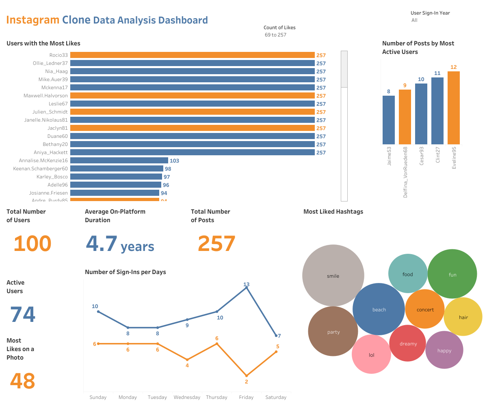

---

### 2) NYC Yellow Taxi Analysis (HiveQL)
- **Goal:** Query and analyze large-scale taxi trip records using Hive.
- **HiveQL case study:**
  - [NYC Yellow Taxi Case Study](./Hadoop(Hive)%20-%20NYC%20Yellow%20Taxi%20Case%20Study.txt)

---

### 3) Nashville Housing Data Cleaning (SQL)
- **Goal:** Clean and transform raw housing data for reliable reporting/analysis.
- **SQL script:**
  - [Data Cleaning](./SQL%20-%20Data%20Cleaning.sql)

---

### 4) COVID-19 Data Exploration (SQL)
- **Goal:** Explore trends and summary insights from COVID-19 datasets.
- **SQL script:**
  - [Data Exploration](./SQL%20-%20Data%20Exploration.sql)

---

### 5) Business Intelligence Challenge (PostgreSQL)
- **Goal:** Solve a BI-style analysis challenge using PostgreSQL.
- **Files:**
  - [PostgreSQL BI Challenge](./PostgreSQL-BI-CHALLENGE)

---

### 6) Movies Industry Exploratory Data Analysis (Python)
- **Goal:** Perform EDA to identify trends, patterns, and relationships in movies data.
- **Notebook:**
  - [Movie Industry EDA Notebook](./Python%20-%20Movie%20Industry%20EDA%20Project.ipynb)

---

## Tableau Dashboards (Screenshots )

- Benefits of Working from Home (MakeoverMonday)

  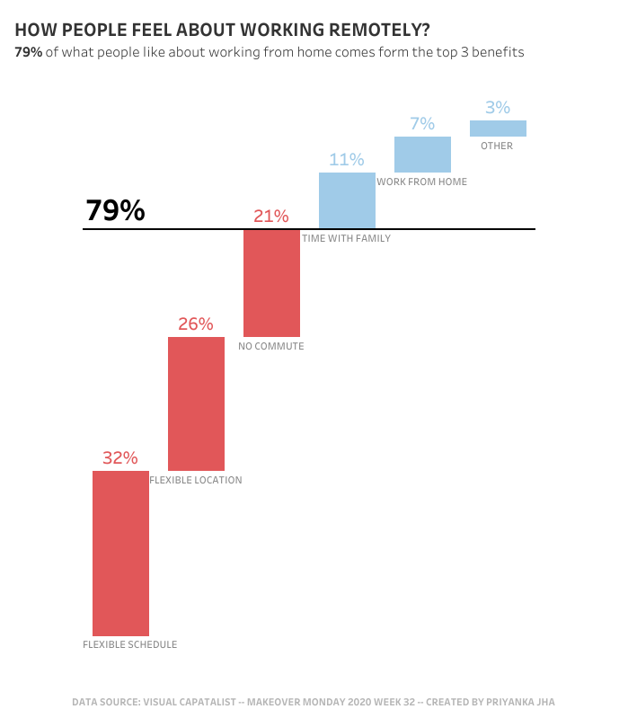

- Municipality Data Analysis

  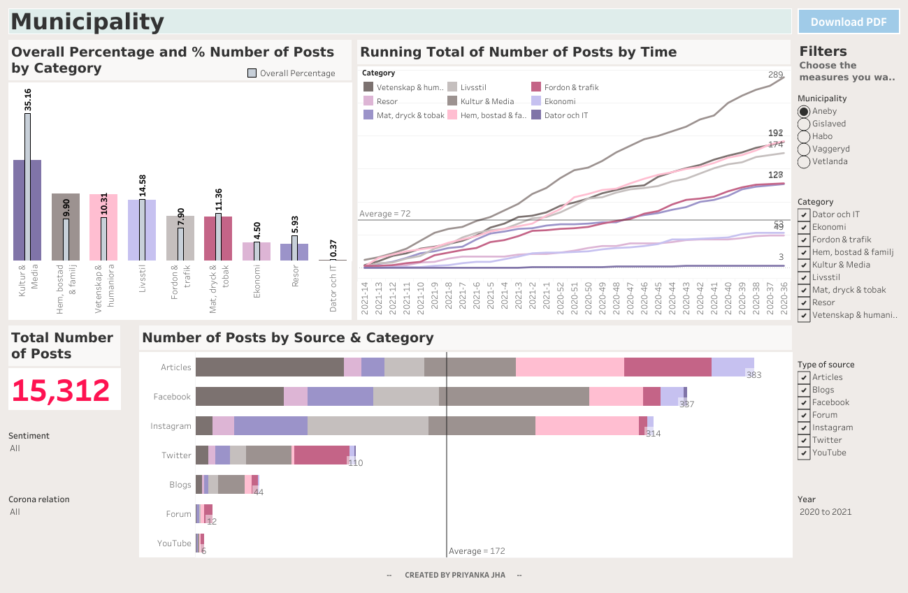

- GROVER Junior Data Analyst Case Study
  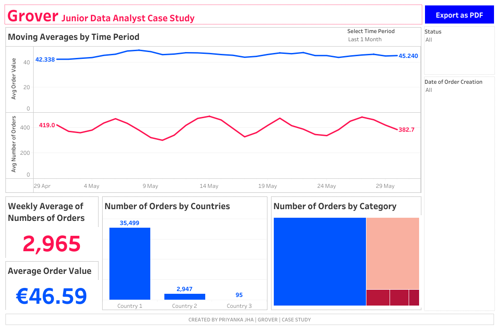

- Retail Pricing Analytics
  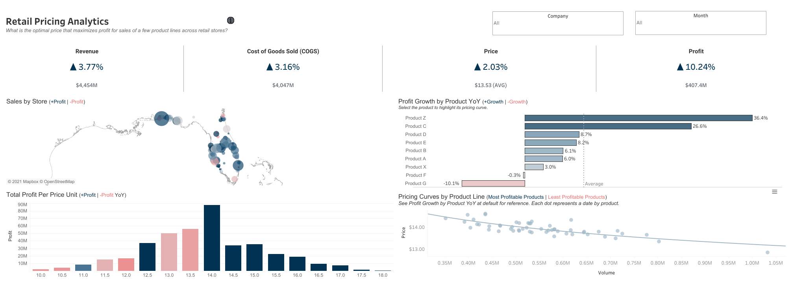

- E-commerce Sales Dashboard
  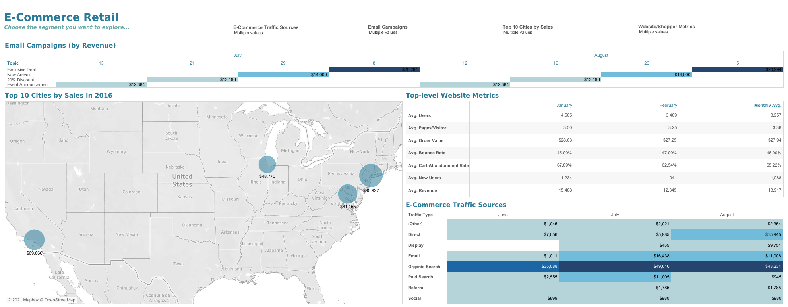
  
- Sales Superstore (Multi-dashboard)
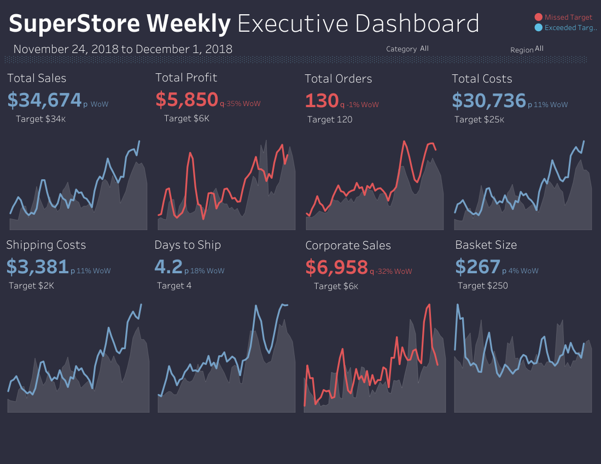

  - Top-Down Dashboard  
  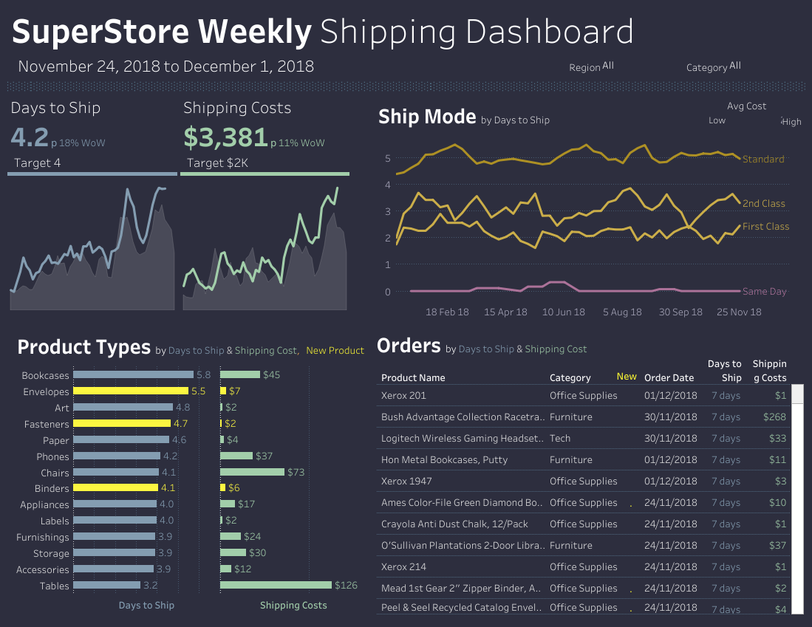

  - Q&A Dashboard  
  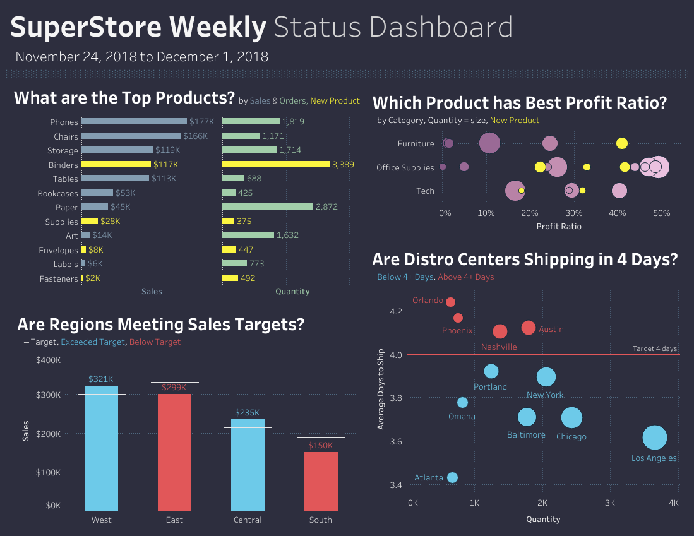

  - Bottom-Up Dashboard  
   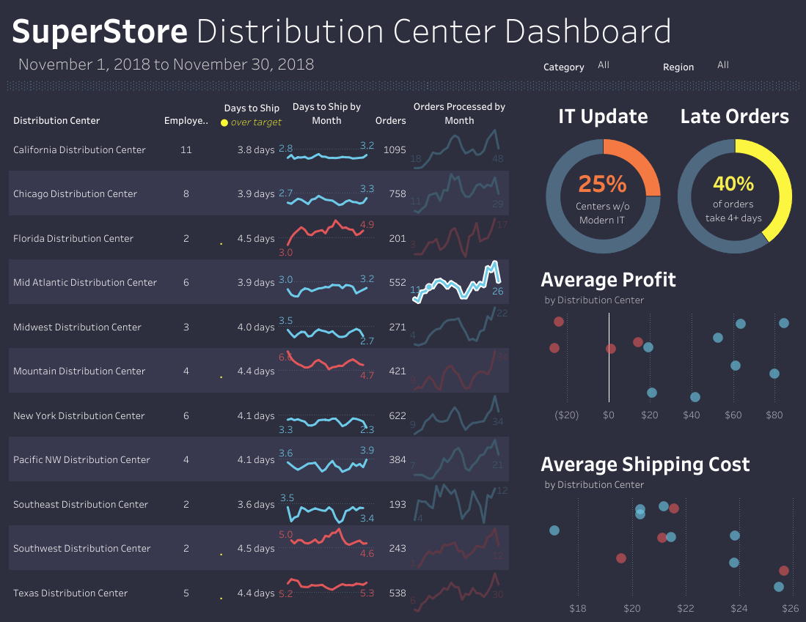

- World Bank CO2 Emissions
  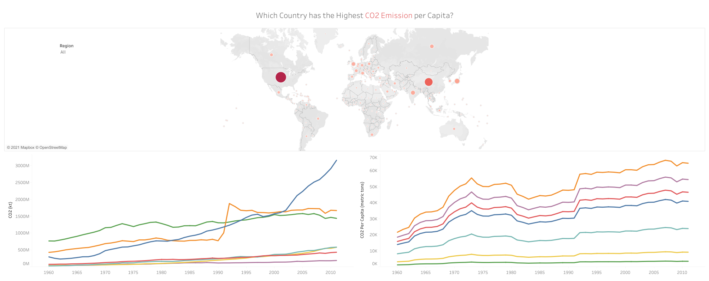

- London Bus Safety
  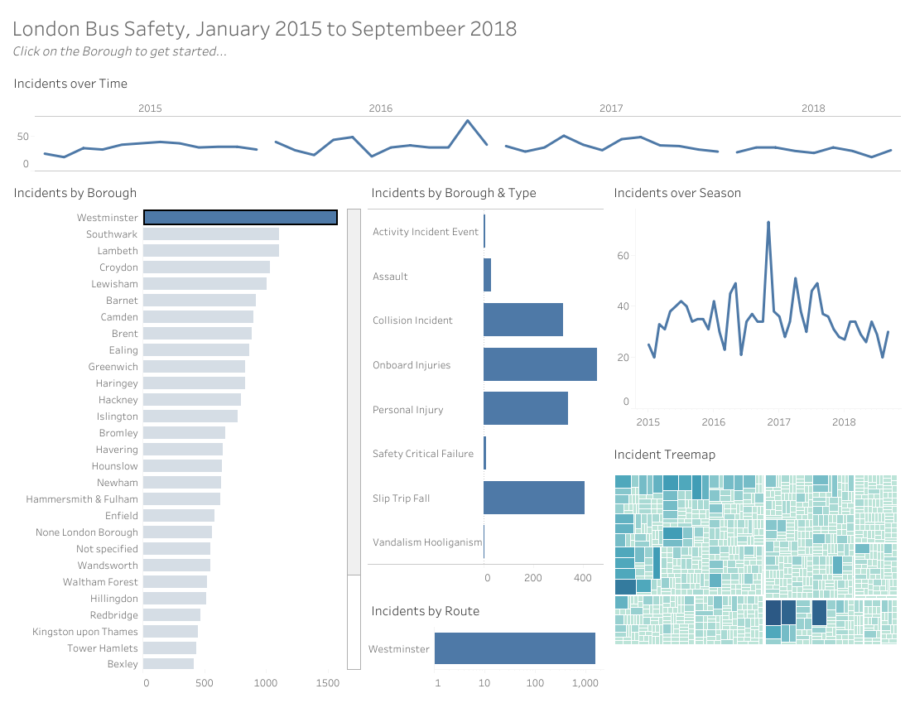

---

## Excel Work (Files in this Repo)
Download and open in Microsoft Excel:
- [Sales Performance Dashboard](./Excel%20-%20Sales%20Performance%20Dashboard.xlsx)
- [LOOKUP, INDEX, MATCH, SUMIFS](./Excel%20-%20LOOKUP,%20INDEX,%20MATCH,%20SUMIFS.xlsx)
- [Pivot Tables, Pivot Chart, Slicers](./Excel%20-%20Pivot%20Tables,%20Pivot%20Chart,%20Slicers.xlsx)
- [Scenario Manager, Solver (Data Modeling)](./Excel%20-%20Scenario%20Manager,%20Solver%20(Data%20Modeling).xlsx)

---

## How to Use
- Open the .sql and .txt scripts to review queries and analysis steps.
- Open the .ipynb notebook in Jupyter/VS Code for Python EDA.
- Use the Tableau Public links to interact with dashboards.
- Download Excel files to view dashboards and models.
